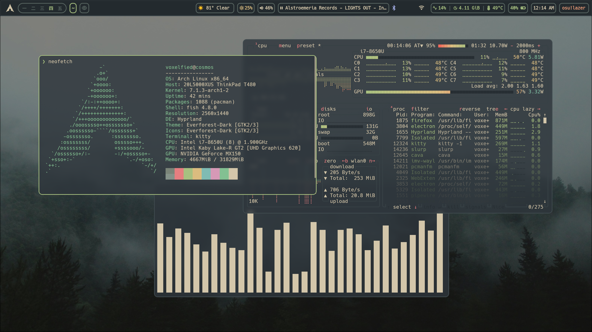
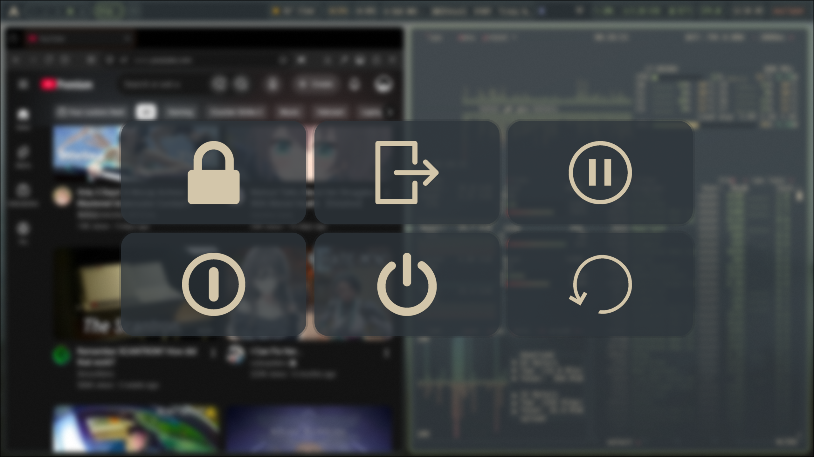

# An Everforest-themed Arch Linux + Hyprland rice

## Use configuration at your own risk

> **Work in progress.** These are my personal dotfiles, but they're organized so others can easily use and modify them

Specifications:
- **Distro:** Arch Linux
- **DE:** Hyprland
- **Terminal:** kitty
- **Shell:** fish
- **Notifications:** mako
- **Bar:** Waybar
- **Logout Menu:** wlogout
- **Menu:** wofi
- **File Manager:** PCManFM
- **Editor:** Neovim
